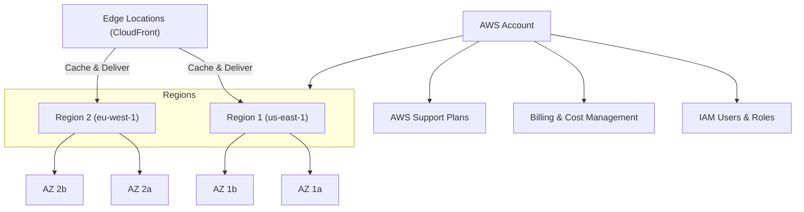

+++
title = "Getting Started with AWS"
weight = 1
+++

This guide introduces the foundational concepts of AWS, including **AWS Account**, **Regions**, **Availability Zones (AZs)**, **Edge Locations**, and **Support**. Understanding these will help you navigate AWS’s global infrastructure confidently.

---

## AWS Account

Your **AWS Account** is your unique identity in the AWS ecosystem. It acts as a container for your resources, billing, and permissions.

- Manages access to AWS services
- Tracks usage and billing
- Supports multiple users via **IAM** (Identity and Access Management)
- Can be organized into **Organizations** for managing multiple accounts

---

## AWS Regions

An **AWS Region** is a geographically distinct area containing multiple data centers.

- Designed for fault tolerance and low latency
- Each Region consists of multiple **Availability Zones**
- Example Regions: `us-east-1` (N. Virginia), `eu-west-1` (Ireland), `ap-south-1` (Mumbai)

---

## Availability Zones (AZs)

Availability Zones are isolated data centers within a Region.

- Physically separated to prevent single points of failure
- Connected via low-latency networks for high availability
- Deploy resources across AZs for fault tolerance and disaster recovery

---

## Edge Locations

**Edge Locations** are part of AWS’s Content Delivery Network (CDN).

- Located globally to cache and deliver content closer to users
- Used by **Amazon CloudFront** to speed up distribution of websites, videos, APIs, etc.
- Improve performance by reducing latency and load on origin servers

---

## AWS Support

AWS offers multiple support plans to help users:

| Plan          | Description                                  |
|---------------|----------------------------------------------|
| Basic         | Free, includes customer service and docs    |
| Developer     | Business hours email support                  |
| Business      | 24/7 phone, chat, and email support           |
| Enterprise    | Dedicated Technical Account Manager and Concierge |

Choose a plan based on your business needs and technical requirements.

---

## Visual Overview

## AWS Well-Architected Framework

The **AWS Well-Architected Framework** helps cloud architects build secure, high-performing, resilient, and efficient infrastructure for their applications. It is based on five pillars:

---

## 1. Operational Excellence

Focuses on running and monitoring systems to deliver business value and continuously improve processes and procedures.

**Key Topics:**

- Perform operations as code
- Make frequent, small, reversible changes
- Refine operations procedures frequently
- Anticipate failure
- Learn from all operational failures

---

## 2. Security

Protect information, systems, and assets while delivering business value through risk assessments and mitigation strategies.

**Key Topics:**

- Implement strong identity foundation
- Enable traceability
- Apply security at all layers
- Automate security best practices
- Protect data in transit and at rest
- Prepare for security events

---

## 3. Reliability

Ensure a workload performs its intended function correctly and consistently when expected.

**Key Topics:**

- Automatically recover from failure
- Test recovery procedures
- Scale horizontally to increase aggregate workload availability
- Manage change in automation

---

## 4. Performance Efficiency

Use IT and computing resources efficiently to meet system requirements and maintain efficiency as demand changes.

**Key Topics:**

- Democratize advanced technologies
- Go global in minutes
- Use serverless architectures
- Experiment more often
- Monitor performance and make trade-offs

---

## 5. Cost Optimization

Avoid unnecessary costs by selecting the right resource types and sizes, and scaling to meet actual needs without overspending.

**Key Topics:**

- Adopt a consumption model
- Measure overall efficiency
- Stop spending money on undifferentiated heavy lifting
- Analyze and attribute expenditure
- Use managed services to reduce cost of ownership

---

## Summary

The AWS Well-Architected Framework provides a consistent approach to evaluate architectures and implement designs that will scale over time. It’s essential for building resilient and efficient applications on AWS.

---

For more details, visit the [AWS Well-Architected Framework official page](https://aws.amazon.com/architecture/well-architected/).
